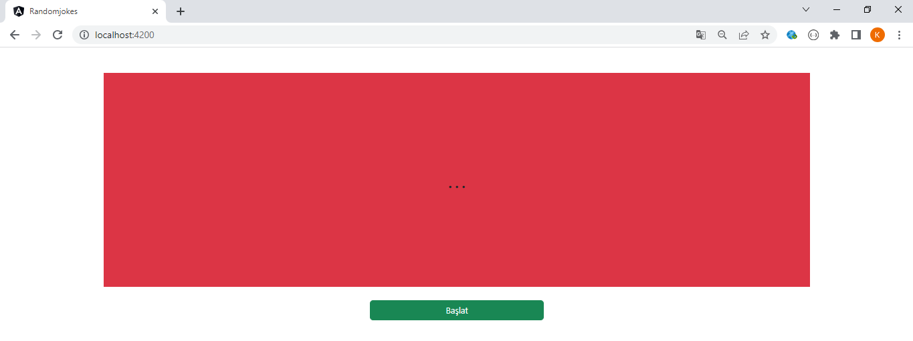
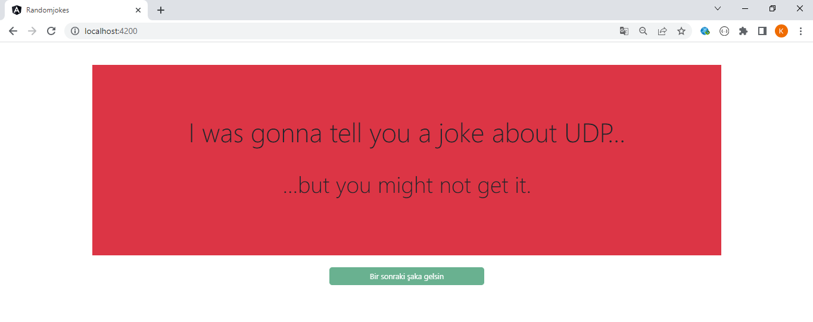
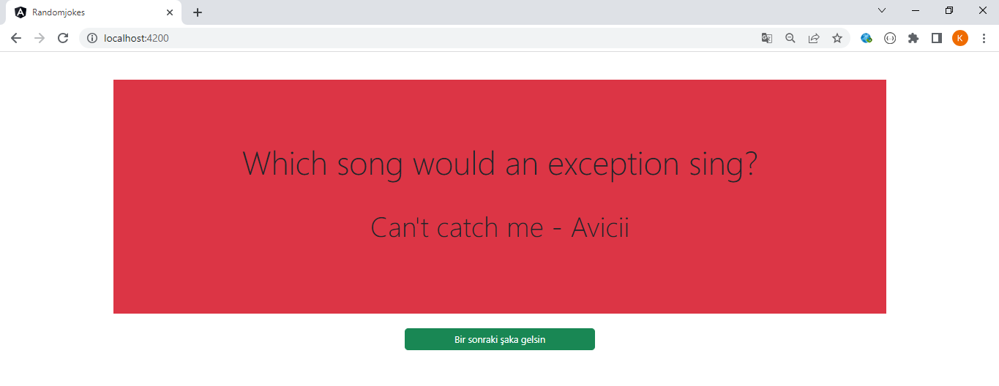

Uygulama Başlat butonu ile rastgele şakalar üretmeye başlar.

İlk şaka çekildikten sonra 4 saniye boyunca buton disabled duruma geçer. Bunun sebebi kullanıcının butona seri bir şekilde birden fazla basması durumunda yine birden fazla şaka çekilir ve görüntüde bozulmalara neden olur. Böyle bir mekanizma ile bu sorunun önüne geçildi.

4 saniye bekledikten sonra Bir sonraki şaka gelsin butonu aktif olur.

